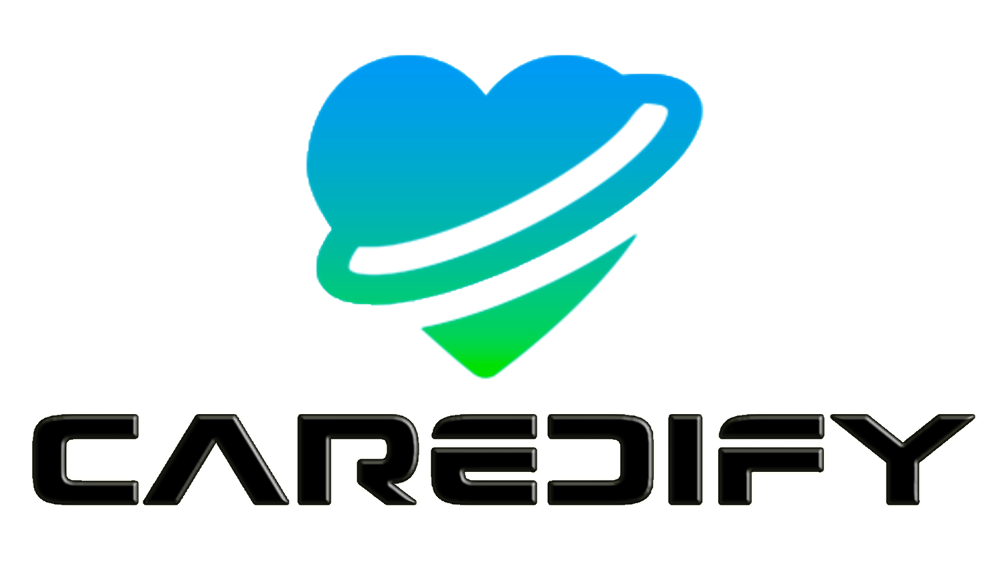

<p align="center">
  
</p>

# CAREDIFY

**Smart ECG Monitoring & AI Health Companion**

---

## 🚀 Overview

CAREDIFY is an innovative telehealth app for patients at risk of heart failure. It pairs with a smart ECG belt to provide real-time cardiac monitoring, AI-driven health tips, and secure communication with healthcare professionals. Designed for seniors, CAREDIFY features a soft, reassuring interface and robust accessibility.

---

## 🧩 Key Features

- **Authentication:** Email/password login, onboarding, registration, forgot password. (Google/Facebook login planned)
- **Dashboard:** Real-time vitals, ECG card, heart tracker, water intake, sleep rating, workout tracker, health index, healthy habits, weekly charts.
- **Accessibility:** Font size toggle, dark/light/system theme, TTS (voice feedback), RTL support, large tap zones, screen reader labels.
- **Internationalization:** Full support for English, French, Arabic via `.arb` files; instant language switching.
- **Voice Feedback:** TTS for all major actions and alerts, toggleable in accessibility controls.
- **Legal & Compliance:** Privacy Policy, Terms of Service screens.
- **Profile:** User profile management.
- **Planned/Upcoming:** Chat with doctors, AI health recommendations, BLE device pairing, Google/Facebook login.

---

## 🏗️ Architecture

- **Feature-first modular structure:**
  - `lib/features/` – Auth, dashboard, profile, legal, recommendations, chat
  - `lib/core/` – Theme, utils, constants
  - `lib/widgets/` – Reusable UI components
  - `lib/providers/` – State management (Riverpod)
  - `lib/models/` – Data models
  - `lib/l10n/` – Localization files (`.arb`)
- **Routing:** GoRouter
- **State Management:** Riverpod

---

## ♿ Accessibility

- Font size toggle (normal/large)
- Theme toggle (light/dark/system)
- Voice feedback (TTS) toggle
- Language selector (EN/FR/AR)
- RTL support
- Large, touch-friendly UI
- Screen reader labels

---

## 🌐 Internationalization

- `.arb` files for EN, FR, AR in `lib/l10n/`
- All UI and TTS fully localized
- Language switching in-app

---

## 🔐 Security & Compliance

- GDPR & HIPAA-ready design
- Privacy Policy & Terms screens
- (Planned) AES-256 encryption, secure storage, HTTPS-only, offline sync

---

## 📊 Dashboard & UI Components

- Floating bottom navigation bar
- Cards for ECG, heart, water, sleep, workouts, health index
- Weekly charts, metrics row, circular step counter

---

## 📡 BLE Connection & Pairing

- UI placeholders for BLE/ECG device connection (Movesense planned)
- BLE logic not yet implemented, but navigation and UI are ready

---

## 🚧 Planned Features

- Chat with doctors (feature folder present, not yet implemented)
- AI health recommendations (feature folder present, not yet implemented)
- BLE device pairing (UI present, logic planned)
- Google/Facebook login (UI present, logic TODO)

---

## 🛠️ Tech Stack

| Tech                   | Usage                        |
|------------------------|-----------------------------|
| Flutter                | UI, cross-platform           |
| Dart                   | Main language                |
| Riverpod               | State management             |
| GoRouter               | Navigation                   |
| flutter_tts            | Voice feedback (TTS)         |
| flutter_localizations  | i18n/l10n                    |
| .arb                   | Localization files           |
| Material Design        | UI/UX                        |

---

## ▶️ How to Run

1. **Prerequisites:**
   - [Flutter](https://flutter.dev/) 3.10+
   - Dart 3.0+
   - Android Studio or Xcode (for iOS)
   - (Optional) Movesense ECG device for full functionality

2. **Setup:**
   ```bash
   flutter pub get
   flutter run
   ```

---

## 📄 License

This project is licensed under the MIT License. See [LICENSE](LICENSE) for details.

---

## 🙌 Credits

- **Lead Developer:** Saif Yahyaoui
- **Supervision:** [Supervisor Name]
- **Design:** [Figma UI Team]
- **Special Thanks:** All contributors and testers

---

## 📸 Screenshots

<p align="center">
  
  
  
</p>

---

## 📌 More

- [Cahier des Charges (FR)](docs/cahier_des_charges.pdf)
- [Figma UI Kit](#)
- [API Documentation](#)

---

**For more details, see the codebase and comments in each folder.**

---

**This version is now clean, professional, and focused—ready for users, developers, and stakeholders.**
